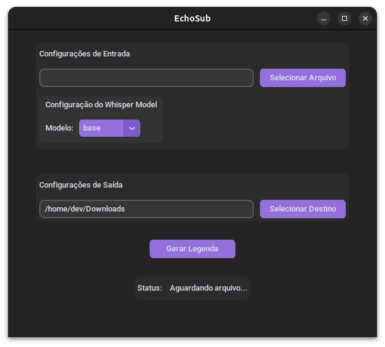

# 🎧 EchoSub

**EchoSub** é uma aplicação em Python que utiliza o modelo Whisper, da OpenAI, para gerar legendas automáticas a partir de vídeos.



## 📦 Requisitos

- Python 3.8 ou superior
- [whisper](https://github.com/openai/whisper)
- ffmpeg instalado no sistema (para extração de áudio)

## ⚙️ Instalação

1. Clone o repositório:

```bash
git clone https://github.com/joserochadev/echosub.git
cd echosub

```

2. Crie um ambiente virtual:

```bash
python3 -m venv .venv
source .venv/bin/activate

```

3. Instale as dependêcias utilizando o **Poetry**:

```bash
poetry install

```

4. Certifique-se de que o ffmpeg está instalado:

```bash
ffmpeg --version
```

5. Inicie o EchoSub:

> **⚠️ ATENÇÃO:** Ao utilizar um modelo do Whisper pela primeira vez, o sistema precisará fazer o download desse modelo. Esse processo pode levar algum tempo, dependendo da velocidade da sua conexão.

```bash
python app.py
```
